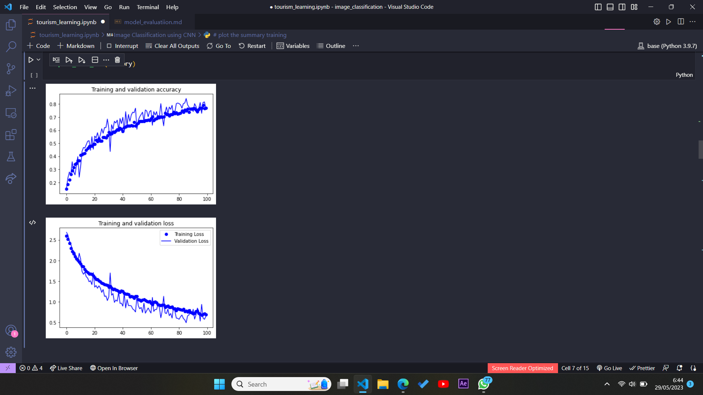
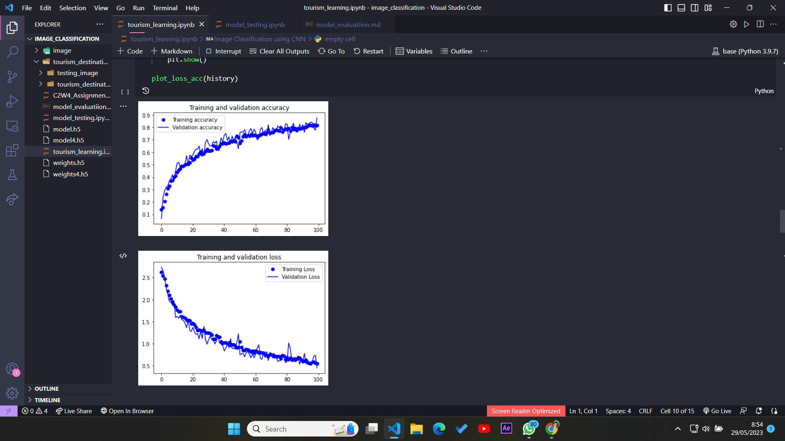
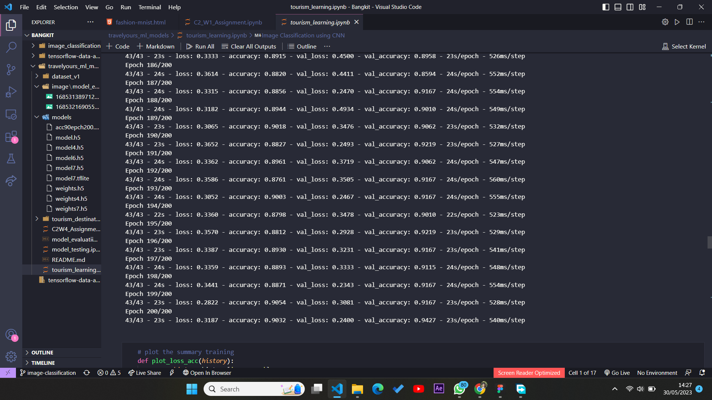
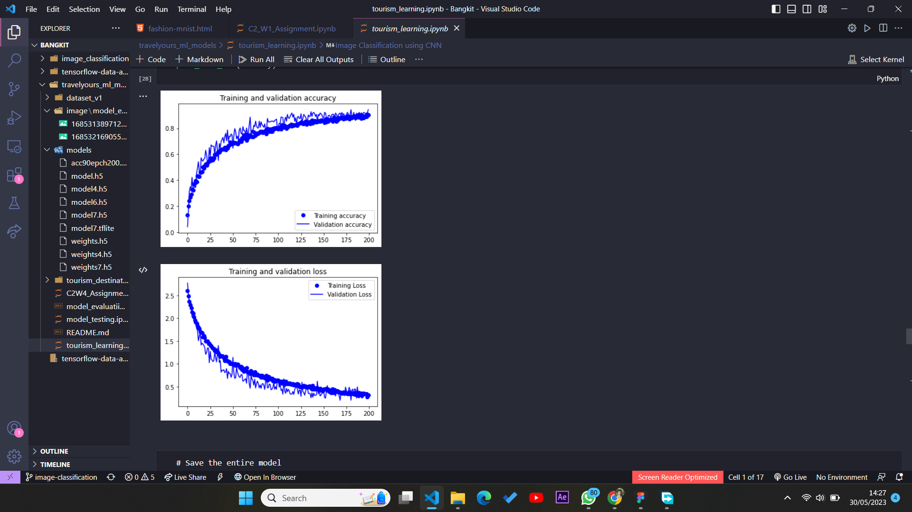
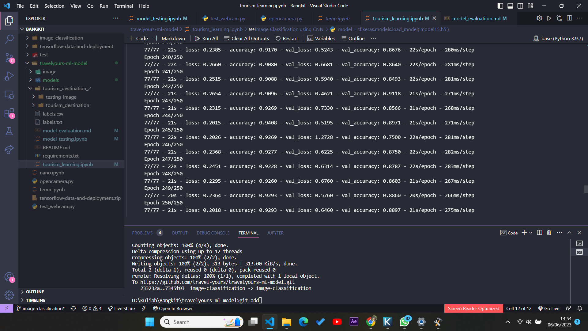
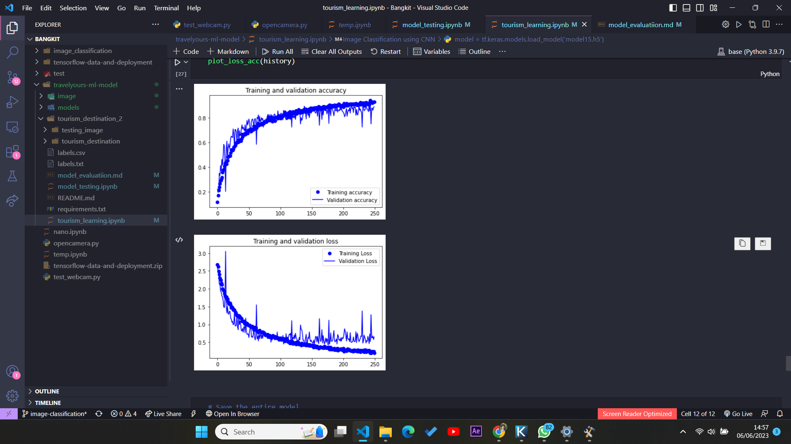

# Model Evaluation

Ketika melakukan beberapa kali percobaan didapatkan hasil sebagai berikut:

### Percobaan 1

Kondisi: 1 kali **augmentasi**, 50 **epoch**, loss function **categorical crosssentropy** dan Optimizer **RMSProp (lr = 1e-4)).**

Didaparkan hasil:

val_loss = 1.2xx	val_acc = 0.67xxx

### Percobaan 2

Kondisi: 100 kali **augmentasi**, 100 **epoch**, loss function categorical crosssentropy dan Optimizer **RMSProp (lr = 1e-5 & 6))**.

Didapatkan hasil:

val_loss 0.2xxx,	val_acc = 0.2xxx,

Hasil terjebak di local minimum.

loop dihentikan di iterasi 15.

### Percobaan 3

Kondisi: 100 kali augmentasi, 100 epoch, loss function categorical crosssentropy dan Optimizer **RMSProp (lr = 1e-2))**.

Didapatkan hasil:

val_loss 2.2xxx,	val_acc = 0.08xxx,

Hasil terjebak di local minimum dan validation loss tidak menunjukkan penurunan lagi.

Loop dihentikan di iterasi 10.

### Percobaan 4

Kondisi: 100 kali **augmentasi**, 100 **epoch**, loss function categorical crosssentropy dan Optimizer **RMSProp (lr = 1e-4))**.

Didapatkan hasil:

val_loss 0.4xxx,	val_acc = 8.3xxx,

Didapatkan best accuracy dan loss. Dengan grafik sebagai berikut:

Setelah dilakukan testing dengan beberapa data test, didapatkan hasil sebagai berikut:

1/1 [==============================] - 0s 209ms/step
Image: borobudur (199).jpg - Predicted class: borobudur
1/1 [==============================] - 0s 59ms/step
Image: borobudur (200).jpg - Predicted class: borobudur
1/1 [==============================] - 0s 51ms/step
Image: gunung_ranjani (53).jpg - Predicted class: pantai_penyu
1/1 [==============================] - 0s 53ms/step
Image: gunung_ranjani (54).jpg - Predicted class: gunung_ranjani
1/1 [==============================] - 0s 53ms/step
Image: martapura (65).jpg - Predicted class: monas
1/1 [==============================] - 0s 46ms/step
Image: monas (187).jpg - Predicted class: monas
1/1 [==============================] - 0s 47ms/step
Image: monas (189).jpg - Predicted class: monas
1/1 [==============================] - 0s 46ms/step
Image: monumen_lobar (37).jpg - Predicted class: tugu_jogja
1/1 [==============================] - 0s 52ms/step
Image: monumen_lobar (38).jpg - Predicted class: monumen_lobar
1/1 [==============================] - 0s 50ms/step
Image: monumen_mataram_metro (59).jpg - Predicted class: monumen_mataram_metro
1/1 [==============================] - 0s 48ms/step
Image: museum_tsunami (94).jpg - Predicted class: museum_tsunami
1/1 [==============================] - 0s 49ms/step
Image: museum_tsunami (96).jpg - Predicted class: borobudur
1/1 [==============================] - 0s 52ms/step
Image: pantai_penyu (89).jpg - Predicted class: pantai_penyu
1/1 [==============================] - 0s 60ms/step
Image: pantai_penyu (94).jpg - Predicted class: pantai_penyu
1/1 [==============================] - 0s 52ms/step
Image: prambanan (148).jpg - Predicted class: prambanan
1/1 [==============================] - 0s 52ms/step
Image: prambanan (153).jpg - Predicted class: prambanan
1/1 [==============================] - 0s 48ms/step
Image: ptani (103).jpg - Predicted class: tugu_jogja
1/1 [==============================] - 0s 62ms/step
Image: ptani (107).jpg - Predicted class: borobudur
1/1 [==============================] - 0s 44ms/step
Image: pura_suranadi (33).jpg - Predicted class: pura_suranadi
1/1 [==============================] - 0s 50ms/step
Image: rumah_aceh (74).jpg - Predicted class: rumah_aceh
1/1 [==============================] - 0s 51ms/step
Image: rumah_aceh (77).jpg - Predicted class: rumah_aceh
1/1 [==============================] - 0s 52ms/step
Image: sarinah (16).jpg - Predicted class: sarinah_mall
1/1 [==============================] - 0s 54ms/step
Image: sarinah (18).jpg - Predicted class: prambanan
1/1 [==============================] - 0s 54ms/step
Image: soedirman (138).jpg - Predicted class: prambanan
1/1 [==============================] - 0s 47ms/step
Image: soedirman (139).jpg - Predicted class: jendral_sudirman
1/1 [==============================] - 0s 57ms/step
Image: soedirman (140).jpg - Predicted class: jendral_sudirman
1/1 [==============================] - 0s 48ms/step
Image: taman_sangkreang (25).jpg - Predicted class: taman_sangkreang
1/1 [==============================] - 0s 56ms/step
Image: taman_sangkreang (32).jpg - Predicted class: taman_sangkreang
1/1 [==============================] - 0s 52ms/step
Image: tugu_jogja (132).jpg - Predicted class: tugu_jogja
1/1 [==============================] - 0s 45ms/step
Image: tugu_jogja (135).jpg - Predicted class: borobudur

### Percobaan 5

Kondisi: 100 kali **augmentasi**, 100 **epoch**, loss function categorical crosssentropy dan Optimizer **Adam (lr = 1e-4))**.

Didapatkan hasil:

val_loss 0.4xxx,	val_acc = 8.7xxx,

testing accuracy = 0.5333333333333333

### Percobaan 6

Nama model = model7.h5

Kondisi: 200 kali **augmentasi**, 200 **epoch**, loss function categorical crosssentropy dan Optimizer **RMSprop (lr = 1e-4))**.

Didapatkan hasil:

val_loss 0.2xxx,	val_acc = 9.4xxx,

Testing Accuracy:  0.9636363636363636
Total True Predictions:  265
Total False Predictions:  10

Dengan gambaran sebagai berikut:

### Percobaan 7

Nama model = model15.h5

Kondisi: 200 kali **augmentasi**, 250 **epoch**, loss function categorical crosssentropy dan Optimizer **RMSprop (lr = 1e-4))**.

Didapatkan hasil:

val_loss 0.4xxx,	val_acc = 0.91xxx,

Accuracy:  0.8981818181818182
Total True Predictions:  247
Total False Predictions:  28

Dengan gambaran sebagai berikut:

